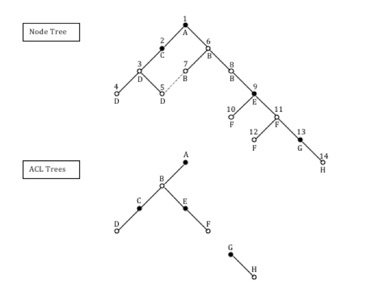

# An ACL example

This example relates a tree of nodes to two corresponding trees of ACLs. The nodes in the node tree are identified by number and are shown filled in black if they have any ACEs set, or white/clear if not. Primary child relationships are drawn as black lines and secondary child relationships as dashed lines. ACLs in the ACL trees are identified by letter, DEFINING ACLs are shown filled in black, and SHARED ALCs are shown as clear. Under each node on the node tree the related ACL is referenced.

The table describes the ACEs in each ACL and their position.

|ACL format|Authority|Permission|Allow/Deny|Position|
|----------|---------|----------|----------|--------|
|ACL A \(Defining, no inheritance\)|All|Read|Allow|0|
|ACL B \(Shared, inherits from ACL A\)|All|Read|Allow|1|
|ACL C \(Defining, inherits from ACL B\)|All|Read|Allow|2|
|ROLE\_OWNER|All|Allow|0|
|GROUP\_A|Write|Allow|0|
|GROUP\_A|CreateChildren|Allow|0|
|ACL D \(Shared, inherits from ACL C\)|ALL|Read|Allow|3|
|ROLE\_OWNER|All|Allow|1|
|GROUP\_A|Write|Allow|1|
|GROUP\_A|CreateChildren|Allow|1|
|ACL E \(Defining, inherits from ACL B\)|All|Read|Allow|2|
|Andy|All|Allow|0|
|Bob|Write|Allow|0|
|Bob|WriteContent|Deny|0|
|ACL F \(Shared, inherits from ACL E\)|All|Read|Allow|3|
|Andy|All|Allow|1|
|Bob|Write|Allow|1|
|Bob|WriteContent|Deny|1|
|ACL G \(Defining, no inheritance\)|Bob|All|Allow|0|
|ACL H \(Shared, inherits from ACL G\)|Bob|All|Allow|1|

ACL A, and any ACL that inherits from it, allows Read for everyone \(All\) unless permissions are subsequently denied for everyone \(All\). If ACL A is changed, all the ACLs that inherit from ACL A in the ACL tree will reflect this change. In the example, nodes 1-12 would be affected by such a change. Nodes 13 and 14 would not inherit the change due to the definition of ACL G.

ACL C adds Contributor and Editor permissions for any authority in GROUP\_A.

**Note:** The GROUP\_ prefix is normally hidden by the administration pages of Alfresco Explorer and Alfresco Share.

Anyone in GROUP\_A can edit existing content or create new content. The owner ACE means that anyone who creates content then has full rights to it. The ACE assignment for owner is not normally required as all rights are given to node owners in the context-free ACL defined in the default permission configuration.

ACL E adds some specific user ACEs in addition to those defined in ACL A. As an example, it allows Bob Write but also denies WriteContent. Write is made up of WriteContent and WriteProperties. Bob will only be allowed WriteProperties.

ACL G does not inherit and starts a new ACL tree unaffected by any other ACL tree unless an inheritance link is subsequently made.

If a new node was created beneath node 13 or 14 it would inherit ACL H. If a new node was created beneath nodes 1, 6, 7, or 8 it would inherit ACL B.

If a node that has a shared ACL has an ACE set, a new defining ACL and a related shared ACL are inserted in the ACL tree. If a defining ACL has all its position 0 ACEs removed, it still remains a defining ACL: There is no automatic clean up of no-op defining ACLs.

**Parent topic:**[Access Control Lists](../concepts/secur-acl.md)

