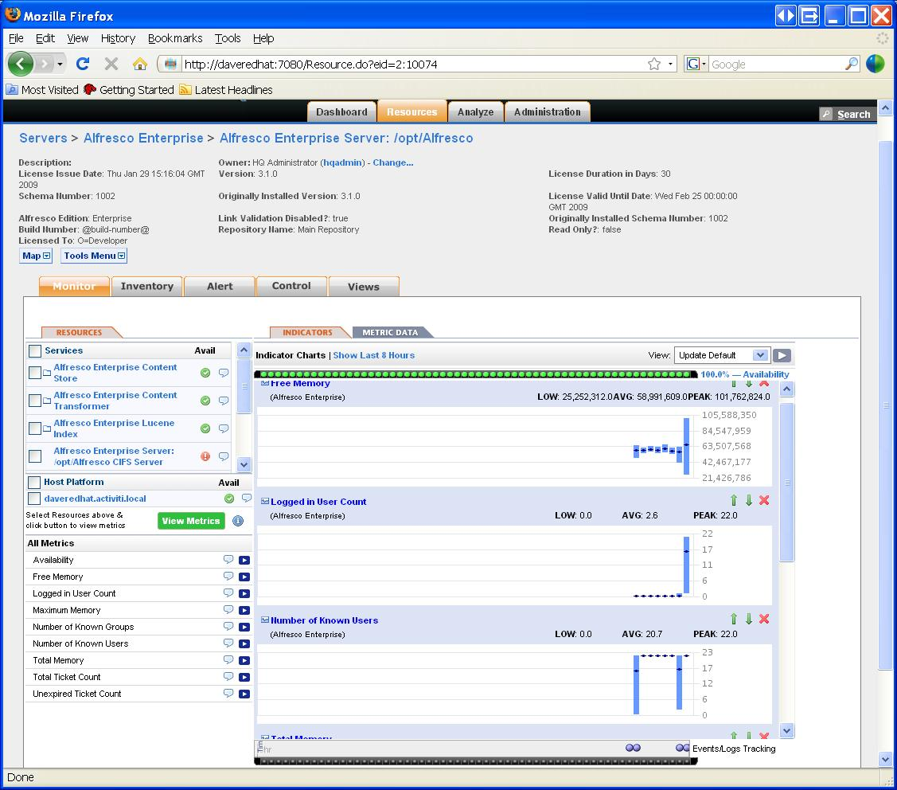

# Installing Alfresco Enterprise plug in for Hyperic

Hyperic provides auto-discovery, monitoring of system resources, alerts, charting, and event correlation for problem identification and resolution. The Alfresco Enterprise plug in for Hyperic allows you to auto-discover all Alfresco components and to monitor usage and performance using the Hyperic HQ interface.

Before you install the Alfresco Enterprise plug in for Hyperic, ensure the following:

-   Hyperic HQ 4.0 Server is installed and running on your system
-   Hyperic HQ Agent is installed on the same machine as Alfresco
-   The operating system user running the Hyperic agent and the operating system user running Alfresco both have permissions to read and write each other's file. For example, both users must be running as root, or alternatively, both users must be in the same group, with umask set to 2.

The Hyperic installation consists of a server and one or more agents. A Hyperic agent running on the same machine as your Alfresco server can use the Alfresco Enterprise plug in to detect running Alfresco servers on the machine, collecting metrics on availability, performance, and use. The agent sends the inventory and metric data to the Hyperic HQ server, which can be managed using the Hyperic portal.

1.  Browse to Alfresco [Alfresco Support Portal](http://support.alfresco.com).

2.  Log in using your user name and password.

3.  Click **Online Resources \> Downloads**.

4.  Search for and download the following Alfresco installation file:

    hyperic-plugin.zip

5.  Copy the downloaded file to the hq-plugins directory in your Hyperic installation.

6.  Open your Alfresco startup script.

7.  Append the following to the JAVA\_OPTS setting:

    \(Windows\) -Dalfresco.home=%ALF\_HOME% -Dcom.sun.management.jmxremote

    \(Linux\) -Dalfresco.home=$\{ALF\_HOME\} -Dcom.sun.management.jmxremote

8.  Save your start up script.

9.  Restart the Hyperic agent using the following command:

    \(Linux\) /etc/init.d/hyperic-hq-agent restart

10. Restart the Alfresco server.

11. In the Hyperic Portal, schedule an auto-discovery. Refer to the Hyperic documentation for details on how to set up auto-discovery.

    The **Alfresco Enterprise Server** is discovered, in addition to all the system resources on the machine.

12. To enable log tracking, click **Resources**, then navigate to the Alfresco Server and select **Inventory**.

13. Under **Configuration Properties**, click **Edit**.

14. Set server.log\_track.enable to true.

15. Set the server.log\_track.level, if required.

    Log entries will then be indicated by a blue light at the bottom of the **Monitor** tab.

**Parent topic:**[Monitoring Alfresco](../concepts/monitoring-intro.md)

